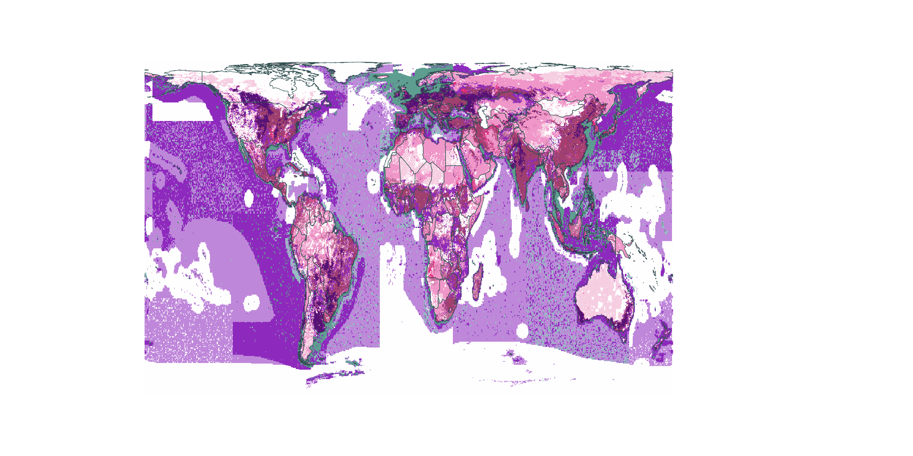

<style>
body {
text-align: justify}
</style>

Script purpose:
- Internal Rmds with maps of raw, intermediate, and final data, etc.

- We need to create some Rmarkdown files with an image of each of the categories/pressures. We will quickly skim through these to identify potential issues with the data (e.g., layers that need gapfilling, errors, etc.).

- I think we will want several Rmds organized by category. I'm not sure of the best categories, but here is one idea:

1. Crops: water, ghg, disturbance, nutrient
2. chicken farm: water, ghg, disturbance, nutrient, consumption files for fish and each crop
3. salmon farm: water, ghg, disturbance, nutrient, consumption files for fish and each crop

- We will also want some images of the more derived files:
"/home/shares/food-systems/Food_footprint/stressors/crop_feed (proportion_crop_to_animals * total_crop_stressor)

And the tifs in: "/home/shares/food_systems/Food_footprint/stressors"

```{r setup, echo = FALSE, include = FALSE, eval = TRUE}
# Open libraries
library(tidyverse)
library(here)
library(raster)
library(sf)
library(knitr)
library(kableExtra)
library(rasterVis)

# Shortcuts
raw      <- "/home/shares/food-systems/Food_footprint/_raw_data/"
prep     <- "/home/shares/food-systems/Food_footprint/dataprep/"
final    <- "/home/shares/food-systems/Food_footprint/final_data/"
stressor <- "/home/shares/food-systems/Food_footprint/stressors/"
review   <- "/home/shares/food-systems/Food_footprint/dataprep/stressor_review/"

# Raster plotting funs
plot_your_raster <- function(shortcut, path_extension, unit, title) {
  
  plot(raster(file.path(shortcut,
                    path_extension, # extension of your file path
                    ".tif",
                    fsep = "")),
       legend = TRUE,
       legend.args = list(text = unit, # unit of measurement for the stressor
                          cex  = 1, 
                          side = 3, 
                          line = 1),
                          main = title)
        }
plot_your_logged_raster <- function(shortcut, path_extension, unit, title) {
  
  plot(raster(file.path(shortcut,
                    path_extension, # extension of your file path
                    ".tif",
                    fsep = "")),
       legend = TRUE,
       legend.args = list(text = unit, # unit of measurement for the stressor
                          cex  = 1, 
                          side = 3, 
                          line = 1),
                          main = title)
  
  plot(log(raster(paste(shortcut,
                        path_extension, 
                        ".tif",
                        sep = ""))),
           legend = TRUE,
           legend.args = list(text = paste(unit, "(logged)", sep = " "), 
                              cex  = 1, 
                              side = 3, 
                              line = 1),
                              main = paste(title, "(logged)", sep = " "))
}

# Define system and stressor
prod_system <- data.frame(short = c("_A","_H","_S","_I","_L"),
                          full  = c("All technologies",
                                    "Rainfed high inputs",
                                    "Rainfed subsistence",
                                    "Irrigated",
                                    "Rainfed low inputs"),
                          stringsAsFactors = FALSE)

review_df <- data.frame(unit     = c("water_unit", "nutrient_unit", "ghg_unit", "disturbance_unit"),
                        stressor = c("ghg", "water", "nutrient", "disturbance"),
                        crop     = rep(c("whea", "maiz"), 2),
                        system   = rep(c("broiler", "salmon"), 2),
                        stringsAsFactors = FALSE)
```

# Spatial

## Different Spatial information tables {.tabset .tabset-pills}

### FAOSTAT_countrycodes.csv

```{r, echo = FALSE, message = FALSE}
head(read_csv(here("_spatial/raw/FAOSTAT_countrycodes.csv"))) %>% 
  head() %>% 
  kable() %>%
  kable_styling(bootstrap_options = "striped", full_width = F, position = "left")
```

### UNSD_Methodology.csv
```{r, echo = FALSE, message = FALSE}
read_csv(here("_spatial/output/UNSD_Methodology.csv")) %>% 
  head() %>% 
  kable() %>%
  kable_styling(bootstrap_options = "striped", full_width = F, position = "left")
```

### FAO_area_names.csv
```{r, echo = FALSE, message = FALSE}
read_csv(here("_spatial/output/FAO_area_names.csv")) %>% 
  head() %>% 
  kable() %>%
  kable_styling(bootstrap_options = "striped", full_width = F, position = "left")
```

### NA_coded_regions_land_based.csv
```{r, echo = FALSE, message = FALSE}
read_csv(here("_spatial/output/NA_coded_regions_land_based.csv")) %>% 
  head() %>% 
  kable() %>%
  kable_styling(bootstrap_options = "striped", full_width = F, position = "left")
```

{-}

## Master Regions {.tabset .tabset-pills}

### EEZ_master_rgns.csv
```{r, echo = FALSE, message = FALSE, warning = FALSE}
read_csv(here("_spatial/output/eez_master_rgns.csv")) %>% 
  head() %>% 
  kable() %>%
  kable_styling(bootstrap_options = "striped", full_width = F, position = "left")
```

### EEZ_master_rgns_translate.csv
```{r, echo = FALSE, message = FALSE}
read_csv(here("_spatial/output/eez_master_rgns_translate.csv")) %>% 
  head() %>% 
  kable() %>%
  kable_styling(bootstrap_options = "striped", full_width = F, position = "left")
```

### master_rgns.csv
```{r, echo = FALSE, message = FALSE}
read_csv(here("_spatial/output/master_rgns.csv")) %>% 
  head() %>% 
  kable() %>%
  kable_styling(bootstrap_options = "striped", full_width = F, position = "left")
```

### master_subrgns.csv
```{r, echo = FALSE, message = FALSE}
read_csv(here("_spatial/output/master_subrgns.csv"))
```

{-}

------
# MapSPAM

I will use wheat and 'rest of crops' for the narrative.

## Crop selection

```{r, echo = FALSE, message = FALSE}
read_csv(here("crop_farm/data/SI_SPAM_crops_tbl.csv")) %>% 
  kable() %>%
  kable_styling(bootstrap_options = "striped", full_width = F, position = "left")
```

```{r, echo = FALSE, message = FALSE, results = "asis"}
cat('\n##', "MapSPAM maps", '{.tabset}', '\n')

for(i in 1:nrow(prod_system)) {

  cat('\n###', prod_system$full[i], '\n')
  plot(raster(paste(prep,
                    paste("spatial/MapSPAM_correct_extent/spam2010V1r1_global_P_WHEA", 
                          prod_system$short[i],
                          sep = ""), # extension of your file path
                    ".tif",
                    sep = "")),
      legend = TRUE,
      legend.args = list(
        text = "Tonnes", # unit of measurement for the stressor
        cex  = 1, 
        side = 3, 
        line = 1),
      main = prod_system$full[i])
  
  cat('\n')
  
  }
```

## Calculating coefficients

### FAOSTAT production data
```{r, echo = FALSE, message = FALSE, message = FALSE}
read_csv(here("crop_farm/data/FAOSTAT_crop_production_2010_2016.csv")) %>% 
  filter(`Item Code` %in% 15 & `Area Code` %in% c("SRB", "SDN", "TWN", "ALA", "XMI", "XKO")) %>% 
  kable() %>%
  kable_styling(bootstrap_options = "striped", full_width = F, position = "left")
```

### Production coefficients: 

Coefficient: country-level production in 2016/ country-level production in 2010

One caveat of this approach is that FAOSTAT crop production represents production for human feed, not animal feed. While this is a problem, we are assuming that the change in crop production is roughly the same for human feed and animal feed, as a change in crop production will be dependant on factors such as climate, land management, weeds and soil quality, which should affect both the same.

```{r, echo = FALSE, message = FALSE}
read_csv(here("crop_farm/data/scaling_coef.csv")) %>% 
  filter(SPAM_short_name %in% "whea" & iso3c %in% c("USA", "BRA", "GBR")) %>% 
  kable() %>%
  kable_styling(bootstrap_options = "striped", 
                full_width = F, 
                position = "left")
```

## Scaled maps

These are the MAPSPAM production maps we want to use to overlay stressors and impacts associated with crop production.

To get this map, we overlay each raster cell between the coefficient map and crop production map and multiply the two values. So if wheat production in Santa Barbara's raster is 10,000 metric tonnes in 2010 and went up by x1.1 between 2010 and 2016, we would multiply the two to get: 11,000 m3/t predicted production in 2016.

```{r, echo = FALSE, message = FALSE}
plot_your_raster(prep, 
                 "crop_farm/scaled_maps_2016/crop_whea_A_scaled", 
                 "Tonnes", 
                 "Scaled to 2016")
```

## Raster cell allocation

Proportion of national crop production dedicated to each raster cell.

```{r, echo = FALSE, message = FALSE}
plot_your_raster(prep, 
                 "crop_farm/cell_allocation/crop_whea_A_allocation", 
                 "Proportion 0-1", 
                 "Cell allocation")
```

------

# Crop feed
## Crop disturbance 

```{r, echo = FALSE, message = FALSE}
plot(raster(file.path(prep,
                      "crop_disturbance/crop_whea.tif",
                      fsep = "")),
     legend = TRUE,
     legend.args = list(
       text = "Proportion 0-1", # unit of measurement for the stressor
       cex  = 1, 
       side = 3, 
       line = 1),
     main = "Crop disturbance")
```

## Crop emissions {.tabset .tabset-pills}

### Irrigation
```{r, echo = FALSE, message = FALSE, results = "asis"}
read_csv(file.path(prep, "crop_ghg/crop_irrigation_ghg/whea.csv", fsep = ""), 
         col_types = "ddn") %>% 
   rasterFromXYZ(.) %>% 
   plot(.,
      legend = TRUE,
      legend.args = list(
        text = "CO2eq tonnes", # unit of measurement for the stressor
        cex  = 1, 
        side = 3, 
        line = 1),
      main = "Irrigation")
```

### Burning
```{r, echo = FALSE, message = FALSE, results = "asis"}
plot_your_raster(prep,
                 "crop_ghg/crop_residue_burning_ghg/co2eq_emitted/whea",
                 "CO2eq tonnes",
                 "Burning")
```

### Fertilizer: production and transport
```{r, echo = FALSE, message = FALSE, results = "asis"}
plot_your_raster(prep,
                 "crop_ghg/crop_nutrient_ghg/crop_whea_nutrient_CO2eq",
                 "CO2eq tonnes",
                 "Fertilizer: production and transport")
```

### Crop residue leaching
```{r, echo = FALSE, message = FALSE, results = "asis"}
plot_your_raster(prep,
                 "crop_ghg/crop_residue_N2O/co2_eq/res_n2o_co2eq_whea",
                 "CO2eq tonnes",
                 "Crop residue: leaching")
```

### Crop residue burning emissions
```{r, echo = FALSE, message = FALSE, results = "asis"}
plot_your_raster(prep,
                 "crop_ghg/crop_residue_burning_ghg/co2eq_n2o/whea",
                 "CO2eq tonnes",
                 "Crop residue: burning emissions")
```

### Pesticide: production and transport
```{r, echo = FALSE, message = FALSE, results = "asis"}
plot_your_raster(prep,
                 "crop_ghg/crop_pesticide_ghg/crop_whea_pesticide_CO2eq",
                 "CO2eq tonnes",
                 "Pesticide: production and transport")
```

{-}

## Crop nutrient {.tabset .tabset-pills}

### FAOSTAT data for 2016.
```{r, echo = FALSE, message = FALSE}
read_csv(here("crop_nutrient/data/FAOSTAT_2016_nutrient_agri_use.csv")) %>% 
  filter(`Area Code` %in% 231) %>% 
  kable() %>%
  kable_styling(bootstrap_options = "striped", full_width = F, position = "left")
```

### IFA 2014/15 percentages
```{r, echo = FALSE, message = FALSE}
read_csv(here("crop_nutrient/data/IFA_2017_FUBC_pc.csv")) %>% 
  dplyr::select(Country, Fertilizer, Wheat) %>%
  filter(Country %in% c("USA", "ROW")) %>% 
  kable() %>%
  kable_styling(bootstrap_options = "striped", full_width = F, position = "left")
```

### Fertilizer data by crop and country.
```{r, echo = FALSE, message = FALSE}
read_csv(here("crop_nutrient/data/nutrient_df.csv")) %>% 
  filter(iso3c %in% "USA", SPAM_short_name %in% "whea") %>% 
  dplyr::select(-c(SPAM_full_name, tonnes)) %>% 
  kable() %>%
  kable_styling(bootstrap_options = "striped", full_width = F, position = "left")
```

### Fertilizer maps
```{r, echo = FALSE, message = FALSE}
plot_your_raster(prep, 
                 "crop_nutrient/crop_whea_application_N", 
                 "Tonnes",
                 "N fertilizer")
```

### Fertilizer leaching maps
```{r, echo = FALSE, message = FALSE}
plot_your_raster(prep, 
                 "crop_nutrient/crop_whea_nutrient", 
                 "PO4eq tonnes",
                 "Eutrophication potential")
```

## Crop water {.tabset .tabset-pills}

### Water footprint dataframe
```{r, echo = FALSE, message = FALSE}
read_csv(here("crop_water/data/wf_df.csv")) %>% 
  filter(SPAM_short_name %in% "whea" & country %in% "US") %>% 
  head() %>% 
  kable() %>%
  kable_styling(bootstrap_options = "striped", full_width = F, position = "left")
```

### Global average
```{r, echo = FALSE, message = FALSE}
read_csv(here("crop_water/data/global_average.csv")) %>% 
  filter(SPAM_short_name %in% "whea") %>% 
  kable() %>%
  kable_styling(bootstrap_options = "striped", full_width = F, position = "left")
```

### Irrigation
```{r, echo = FALSE, message = FALSE}
read_csv(here("crop_water/data/wf_df_irrigation.csv")) %>% 
  filter(SPAM_short_name %in% "whea" & country %in% "US") %>% 
  kable() %>%
  kable_styling(bootstrap_options = "striped", full_width = F, position = "left")
```

{-}

------
# Analysis

## Circular plots {.tabset .tabset-pills}
### Chicken vs Salmon


### Land vs Ocean


### Broiler


### Salmon


{-}

## Same scale maps

### Broiler {.tabset .tabset-pills}

#### Disturbance


#### GHG


#### Nutrient


#### Water


{-}

### Salmon {.tabset .tabset-pills}

#### Disturbance


#### GHG


#### Nutrient


#### Water


{-}

## Unique scale maps

### Broiler {.tabset .tabset-pills}

#### Disturbance


#### GHG


#### Nutrient


#### Water


{-}

### Salmon {.tabset .tabset-pills}

#### Disturbance


#### GHG


#### Nutrient


#### Water


{-}

## Overlap map

